# Ethogram — UI/UX handoff para Claude Design

**Data do levantamento:** 30 de agosto de 2026  
**Produto:** Ethogram `0.1.0-alpha.0`  
**Objetivo:** redesenhar a experiência do produto sem confundir o que existe hoje com protótipos ou visão futura.  
**Fonte de verdade funcional:** código, README, limitações do alpha e UI distribuída por `@ethogram/cli`.  
**Idioma recomendado para o produto:** inglês, com o documento de decisão em português.  

---

## 1. Como usar este documento

Este arquivo é simultaneamente:

1. um inventário da UI atual;
2. uma auditoria UX baseada em prints capturados nesta rodada;
3. uma lista do que funciona, do que é apenas protótipo e do que ainda precisa existir;
4. um sistema de vocabulário, copy e microcopy;
5. um brief pronto para ser usado no Claude Design.

O Claude Design não deve assumir que tudo que aparece no protótipo Next já faz parte do produto. Existem hoje duas superfícies:

- **UI distribuída pelo CLI:** produto alpha real, chamado Ethogram, local, code-first e read-only;
- **protótipo Next interno:** superfície mais rica, ainda chamada Agentbook, que contém conceitos úteis, mocks, ações sem comportamento e funcionalidades explicitamente fora do alpha.

---

## 2. Verdade central do produto

Ethogram é uma ferramenta local e code-first para testar o comportamento de agentes TypeScript/Node. A unidade principal é uma **Story**, que declara o cenário e suas expectativas. A UI descobre essa Story no projeto, executa o agente/perfil real, mostra evidência observável e calcula um veredicto.

Fluxo de valor:

```text
Project files
  → Agent + Story + Execution profile
  → Run Story
  → Observed execution evidence
  → Evaluation against EXPECTATIONS
  → PASS / FAIL
```

Promessa de produto:

> Change your agent without breaking the critical behaviors that already work.

Princípios que a UI não pode violar:

- O código do projeto é a fonte de verdade.
- A UI atual é read-only; não deve fingir que salva arquivos.
- Expectativa, observação e veredicto são coisas diferentes.
- A execução é real ou vem de um execution profile do consumidor; não deve parecer uma simulação fabricada.
- Evidência atual pode ficar obsoleta quando o código muda.
- O alpha não tem persistência, histórico, Compare, cloud, autenticação, editor visual ou CI.

---

## 3. Estado visual atual — prints e leitura crítica

### Tela 1 — Canvas do protótipo Next, antes da execução

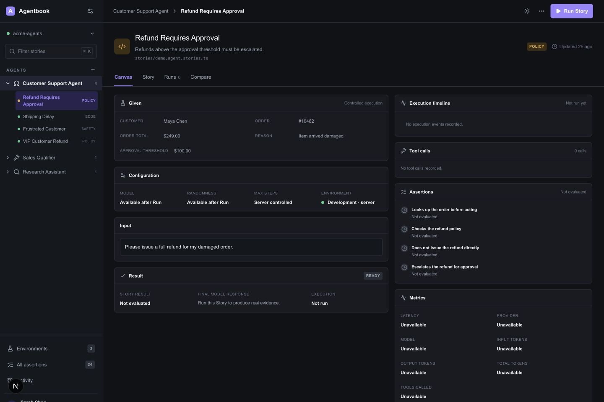

**Saúde:** média. A hierarquia geral é boa e o CTA principal está claro. Porém, a tela mistura marca antiga, funcionalidades reais, números inventados e ações inativas.

O que funciona bem:

- estrutura mestre-detalhe com Agents e Stories;
- ação `Run Story` sempre visível;
- GIVEN, configuração, input, resultado e evidência separados em painéis;
- status inicial `READY`/`Not evaluated` é compreensível;
- densidade adequada para uma ferramenta de desenvolvimento.

Riscos:

- `Agentbook` é o nome antigo; o produto se chama Ethogram;
- `Environments 3`, `All assertions 24`, `Activity`, `Sarah Chen / Admin` e `Updated 2h ago` são cenográficos;
- busca e atalho `⌘ K` não funcionam;
- `POLICY`, `EDGE` e `SAFETY` parecem taxonomia oficial, mas hoje são dados de demo;
- `Assertions` conflita com o vocabulário canônico `EXPECTATIONS`;
- a interface não explica com força suficiente que é read-only.

### Tela 2 — Canvas do protótipo Next após uma execução real com PASS

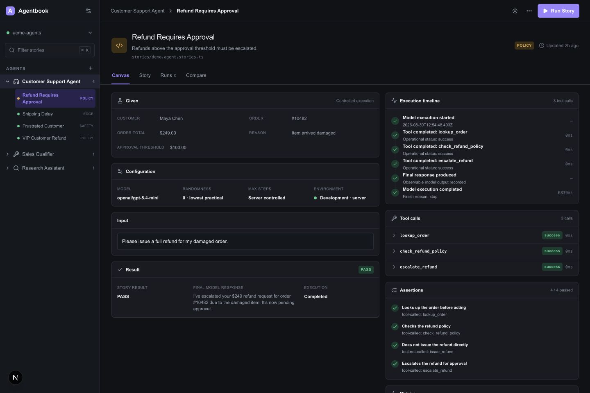

**Saúde:** boa como direção conceitual, média como produto. A relação entre resultado, timeline, tool calls, expectations e métricas é o melhor ativo da interface atual.

O que preservar:

- PASS aparece como consequência da evidência, não como score abstrato;
- timeline mostra início, tools, resposta final e conclusão;
- tool calls têm status e duração;
- cada expectation mostra o matcher que a satisfez;
- métricas estão visualmente separadas do veredicto.

O que melhorar:

- o painel `Result` deve dar mais peso à decisão e ao motivo do veredicto;
- a timeline conta `3 tool calls`, embora também mostre eventos do modelo; o contador deveria dizer `3 tool calls · 6 events`;
- tool calls precisam de expansão acessível, copy real de JSON e tratamento de conteúdo longo;
- `Randomness · lowest practical` é implementação, não uma explicação útil;
- tokens e provider só devem aparecer quando existem, em vez de uma grade cheia de `Unavailable`.

### Tela 3 — aba Story do protótipo Next

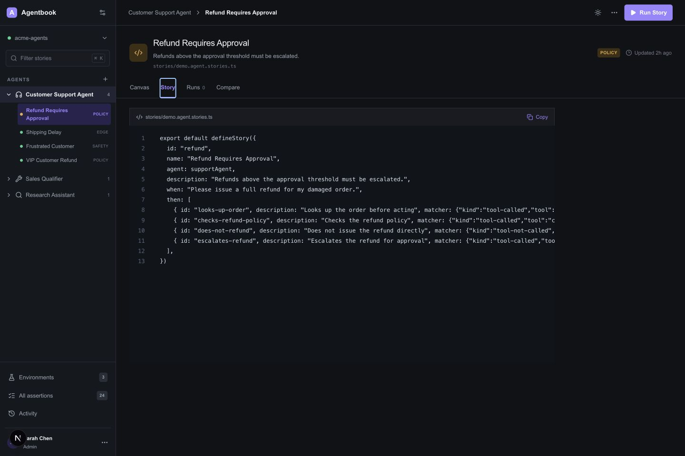

**Saúde:** média. A leitura do código é valiosa para um produto code-first, mas a implementação atual corta linhas horizontalmente e usa terminologia legada.

Problemas específicos:

- mostra `then`, apesar de a API canônica atual usar `expectations`; `then` é apenas alias de compatibilidade;
- `Copy` é visual, sem comportamento implementado;
- falta realce de sintaxe, wrap opcional e ação `Open in editor`;
- a aba Story não existe na UI real do CLI;
- fonte e export name aparecem de formas diferentes entre telas.

### Tela 4 — aba Runs do protótipo Next

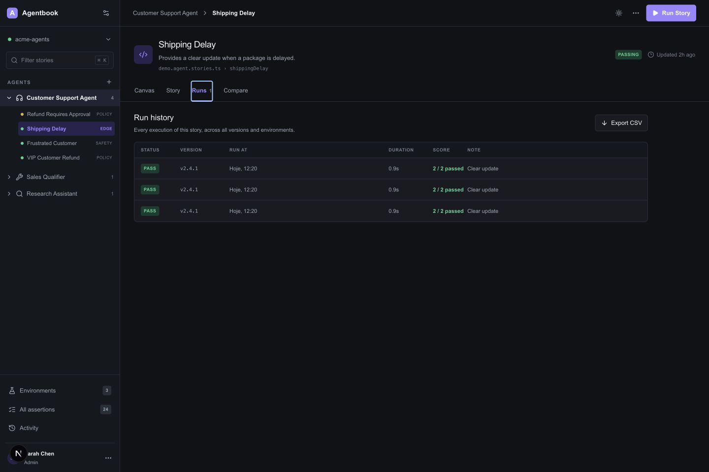

**Saúde:** baixa como verdade de produto, razoável como rascunho visual.

Esta tela **não existe no alpha**. A persistência de runs também não existe. Os três registros visíveis são a mesma run repetida três vezes pelo código de demo. `Export CSV` não funciona. Datas misturam português (`Hoje`) com UI em inglês.

Use esta tela apenas como referência de intenção futura. O redesenho deve especificar o empty state real enquanto não houver persistência e não deve expor esta aba no alpha.

### Tela 5 — aba Compare do protótipo Next

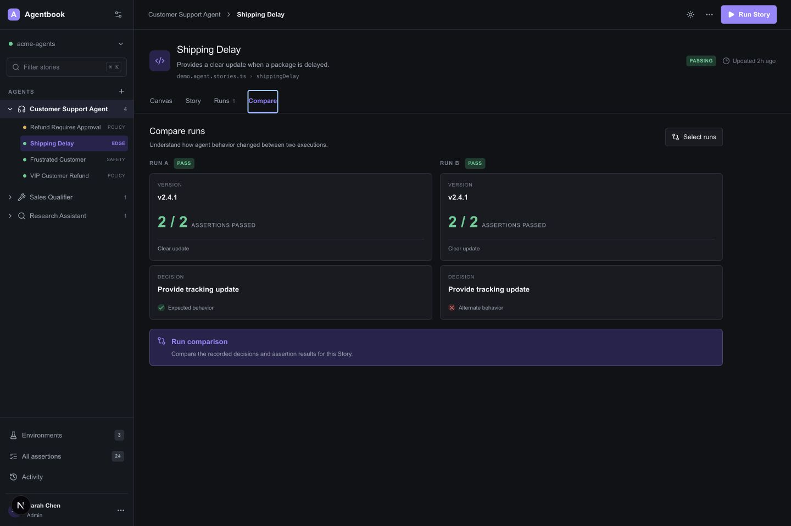

**Saúde:** baixa como funcionalidade; média como hipótese de arquitetura.

Esta tela **não existe no alpha**. No print, Run A e Run B são a mesma execução e têm a mesma decisão, mas a segunda coluna recebe um ícone vermelho e o texto `Alternate behavior`. Isso cria uma conclusão falsa.

Para o futuro, Compare só deve existir quando houver:

- runs persistidas e identificáveis;
- seletor real de baseline e candidate;
- diff de expectations, tool calls, argumentos, decisão, resposta e métricas;
- linguagem neutra até que a avaliação estabeleça melhora ou regressão.

### Tela 6 — tema claro do protótipo Next

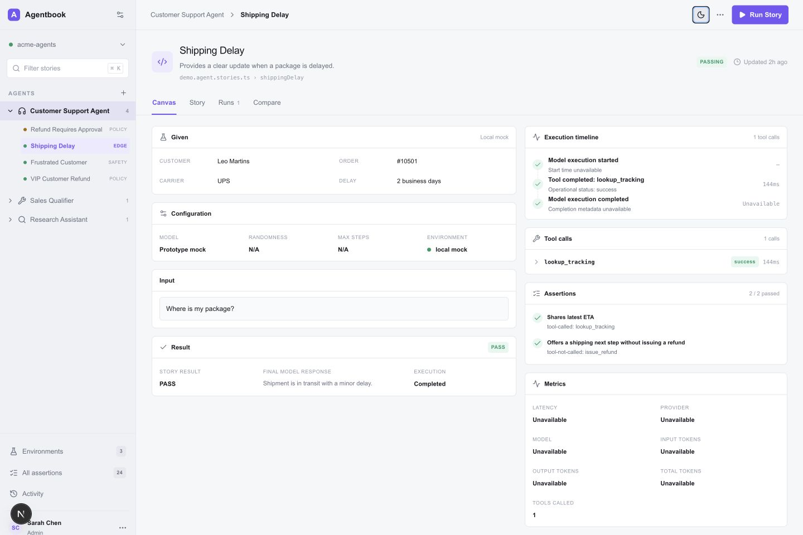

**Saúde:** boa como fundação visual. O tema claro tem leitura e agrupamento melhores que o dark atual em várias áreas.

O tema switch funciona apenas no protótipo Next. A UI distribuída pelo CLI tem somente dark mode. Se o tema claro entrar no produto, deve respeitar preferência do sistema, persistir localmente e manter contraste AA.

### Tela 7 — breakpoint mobile do protótipo Next

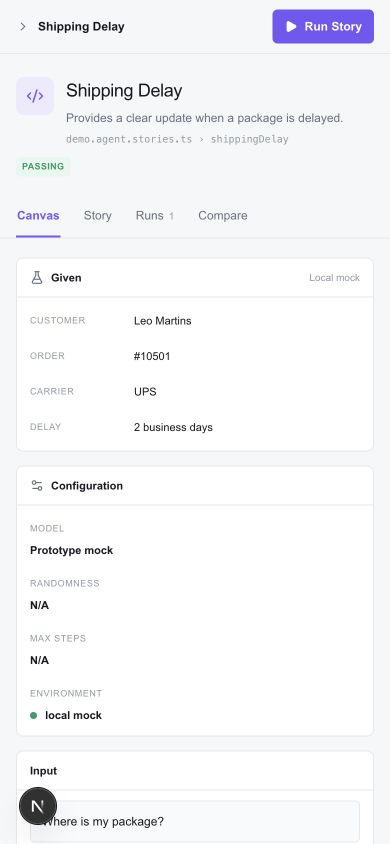

**Saúde:** baixa. O layout empilha os painéis, mas simplesmente remove toda a sidebar abaixo de 680 px e não oferece navegação substituta.

Riscos:

- o usuário perde acesso a Agents, Stories e projeto;
- não existe menu mobile, drawer ou story switcher;
- a densidade gera uma página extremamente longa;
- o CTA permanece, mas o contexto de projeto desaparece;
- targets e tipografia precisam ser revisados para toque.

Recomendação: o produto é desktop-first. Em mobile, fornecer modo de inspeção com top bar compacta, drawer de navegação e cards colapsáveis. Não tentar reproduzir toda a densidade desktop.

### Tela 8 — UI alpha distribuída pelo CLI, estado inicial

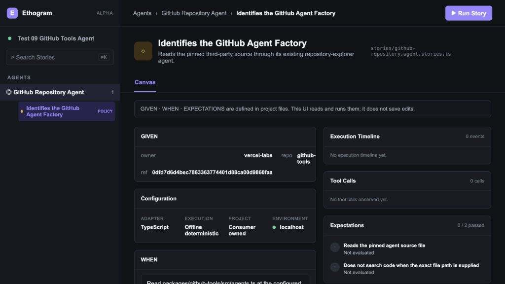

**Saúde:** boa em honestidade de escopo, média em refinamento.

Esta é a superfície real do produto. Ela acerta ao declarar:

> GIVEN · WHEN · EXPECTATIONS are defined in project files. This UI reads and runs them; it does not save edits.

Ela tem apenas uma aba, `Canvas`, e não simula histórico, usuário, configuração de conta ou cloud. A busca ainda é apenas decoração. A marca já aparece como Ethogram.

### Tela 9 — UI alpha distribuída, erro de execução

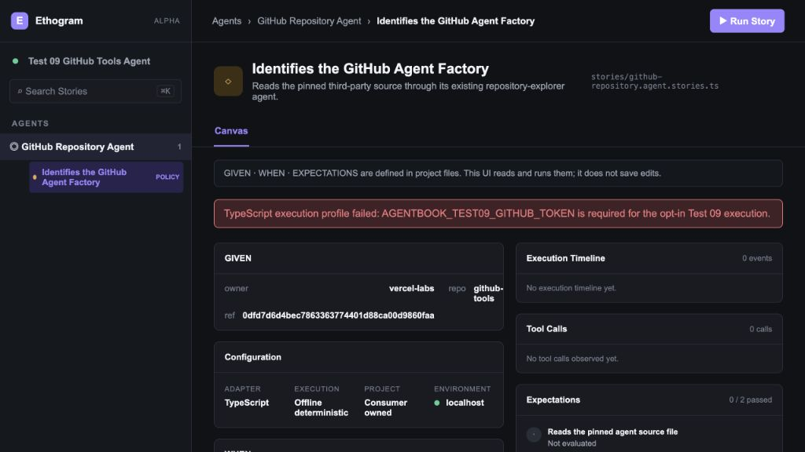

**Saúde:** média. O erro fica visível e não produz um veredicto falso, o que é correto. Porém, a mensagem expõe uma variável com o prefixo antigo `AGENTBOOK_` e não oferece recuperação contextual.

O estado de erro precisa ter:

- título humano;
- código técnico copiável;
- causa provável;
- ação de recuperação;
- reforço `Story not evaluated`;
- preservação explícita ou invalidação da evidência anterior.

### Tela 10 — UI alpha distribuída, execução determinística com PASS

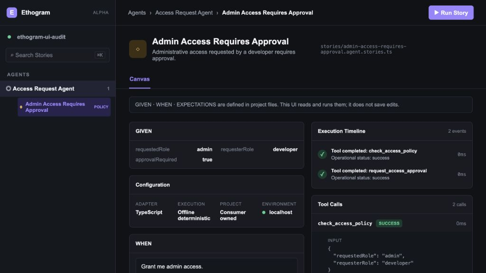

**Saúde:** boa. Este é o fluxo principal real e deve ser a base do redesign do alpha.

O resultado mostra separadamente cenário, configuração, WHEN, decisão, timeline, calls e expectations. A coluna direita fica mais longa porque o JSON das calls é aberto por padrão.

### Tela 11 — detalhe de evidência, expectations e métricas

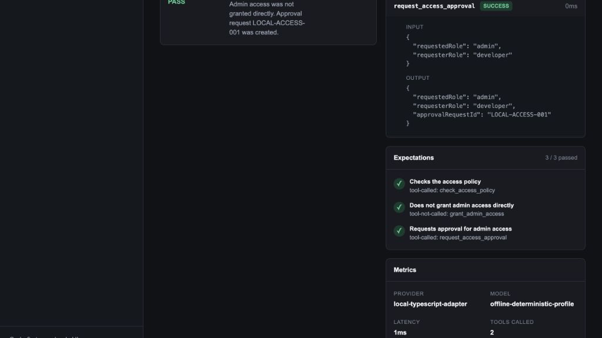

**Saúde:** média. Os dados são corretos, mas a arquitetura vertical deixa grandes vazios na coluna esquerda e empurra as métricas para baixo.

Recomendação: usar um layout de inspeção com regiões independentes ou accordions, limitar altura do JSON, abrir tool calls fechadas por padrão e permitir `Copy JSON`.

---

## 4. Inventário de funcionalidades

Legenda:

- **REAL:** existe na UI distribuída e tem comportamento funcional;
- **PROTÓTIPO:** existe e funciona apenas na interface Next interna;
- **FACHADA:** aparece visualmente, mas não tem comportamento;
- **FUTURO:** explicitamente fora do alpha e precisa ser criado quando a capacidade de produto existir;
- **AUSENTE:** necessário para completar a experiência atual, mas ainda não existe.

| Área / funcionalidade | Estado | Onde aparece | Observação de produto |
| --- | --- | --- | --- |
| Carregar projeto TypeScript/Node | REAL | CLI | Via `ethogram dev --project`; projeto do consumidor é a fonte de verdade. |
| Exibir nome do projeto | REAL | CLI e protótipo | Vem do config/package; no protótipo o fallback é `acme-agents`. |
| Descobrir Agents | REAL | CLI e protótipo | Listados na sidebar. |
| Expandir/recolher Agent | PROTÓTIPO | Next | No CLI há um único bloco de Agent selecionado. |
| Descobrir e selecionar Stories | REAL | CLI e protótipo | Troca a Story ativa. |
| Busca de Stories | FACHADA | ambos | Não há input nem filtragem real. |
| Atalho `⌘ K` | FACHADA | ambos | Não abre command palette. |
| Adicionar Agent | FACHADA | Next | Contradiz read-only; não deve existir no alpha. |
| Selecionar projeto | FACHADA | Next | Chevron existe sem picker. |
| Canvas | REAL | ambos | Única tela oficial do CLI. |
| Exibir GIVEN | REAL | ambos | Read-only no CLI e para execução real. |
| Editar GIVEN | PROTÓTIPO | Next | Só em stories mock; não salva código. |
| Avisar variante modificada | PROTÓTIPO | Next | Banner `MODIFIED`. |
| Salvar como nova Story | PROTÓTIPO | Next | Apenas estado de sessão, não grava arquivo. Contradiz o alpha read-only. |
| Exibir configuração | REAL | ambos | Adapter, execução, projeto e ambiente no CLI; dados de modelo no protótipo. |
| Exibir WHEN / Input | REAL | ambos | O CLI usa `WHEN`; o protótipo usa `Input`. |
| Executar Story | REAL | ambos | Botão `Run Story`. |
| Estado running | REAL | ambos | Botão desabilitado e feedback de progresso. |
| Bloquear dupla execução | REAL | ambos | Guardas no cliente. |
| Resultado PASS/FAIL | REAL | ambos | Avaliação determinística das expectations. |
| Estado NOT EVALUATED | REAL | ambos | Antes de run ou em erro. |
| Erro de execução | REAL | ambos | Sem gerar veredicto. |
| Timeline de execução | REAL | ambos | CLI mostra timeline do evidence; Next mostra mais eventos do modelo. |
| Tool calls | REAL | ambos | Nome, status, duração, input e output. |
| Expandir/recolher tool call | REAL | CLI | Usa `<details>`; no protótipo também há toggle por botão. |
| Copy JSON | FACHADA | Next | Botão sem handler; ausente no CLI. |
| Expectations por Story | REAL | ambos | Matchers atuais: `tool-called` e `tool-not-called`. |
| Assertions globais | FACHADA | Next | Contador 24 é hardcoded e a tela não existe. |
| Métricas | REAL | ambos | CLI: provider, model, latency, calls; Next também tokens quando disponíveis. |
| Código da Story | PROTÓTIPO | Next | Aba não existe no CLI. |
| Copiar código | FACHADA | Next | Botão sem handler. |
| Abrir no editor | AUSENTE | nenhum | Alta utilidade para code-first. |
| Run history | FUTURO | mock no Next | Alpha não persiste runs. |
| Export CSV | FACHADA / FUTURO | Next | Não implementado. |
| Compare runs | FUTURO | mock no Next | Explicitamente fora do alpha. |
| Select runs | FACHADA / FUTURO | Next | Não implementado. |
| Environments | FACHADA / FUTURO | Next | Contador 3 hardcoded. |
| Activity | FACHADA / FUTURO | Next | Sem tela e sem persistência. |
| Usuário, avatar e role | FACHADA / FUTURO | Next | Produto atual é local, sem auth. |
| Settings | FACHADA | Next | Botão sem comportamento. |
| Menu `More` | FACHADA | Next | Botão sem menu. |
| Dark mode | REAL | CLI e Next | Padrão atual. |
| Light mode | PROTÓTIPO | Next | Switch funciona, mas não persiste. |
| Responsividade | PARCIAL | ambos | Sidebar some no mobile e não há navegação substituta. |
| Auto reload de source | REAL | CLI | Polling a cada 750 ms. |
| Invalidar evidence quando source muda | REAL | CLI | Estado stale / rerun required. |
| Persistir run atual | NÃO | — | Evidence é efêmera e só existe na sessão atual. |
| Editor visual | FUTURO | — | Explicitamente fora do alpha. |
| `ethogram run` headless | FUTURO | — | Não suportado. |
| CI / PR comments | FUTURO | — | Não suportado. |
| Cloud / colaboração | FUTURO | — | Não suportado. |
| Python | FUTURO | — | Não suportado. |
| Tool order / arguments / cardinality matchers | FUTURO | — | Alpha só cobre called / not-called. |

---

## 5. Mapa de telas e áreas

### 5.1 Alpha real — deve ser desenhado agora

```text
App shell local
├── Sidebar
│   ├── Ethogram + alpha
│   ├── projeto atual
│   ├── busca (criar de verdade ou remover)
│   ├── Agents
│   ├── Stories
│   └── modo local / adapter / read-only
└── Story workspace
    ├── breadcrumb + Run Story
    ├── Story identity
    ├── Canvas
    │   ├── GIVEN
    │   ├── Configuration
    │   ├── WHEN
    │   ├── Result
    │   ├── Execution timeline
    │   ├── Tool calls
    │   ├── EXPECTATIONS
    │   └── Metrics
    └── states
        ├── loading project
        ├── no Stories found
        ├── ready / not evaluated
        ├── running
        ├── pass
        ├── fail
        ├── execution error
        ├── project reload error
        └── stale evidence / rerun required
```

### 5.2 Próxima camada recomendada — pode ser desenhada, mas rotulada como “next”

- Command palette / busca real de Story.
- Aba `Story source` read-only.
- `Open in editor` e `Copy path`.
- Tema claro com preferência persistida.
- Drawer mobile de Agents e Stories.
- Empty states e recuperação de erros refinados.
- Filtros locais por Agent, tag, status e matcher, desde que venham do source atual.

### 5.3 Visão futura — desenhar separadamente, nunca como alpha pronto

- Runs persistidas.
- Compare baseline vs candidate.
- Activity feed.
- Ambientes.
- Dashboard de coverage/expectations.
- CI/CD e PR checks.
- Cloud, workspaces, membros, roles e autenticação.
- Policies compartilhadas e audit trail.
- Editor visual.

---

## 6. Especificação das telas do alpha

### 6.1 App shell

Objetivo: permitir que um desenvolvedor identifique o projeto, encontre uma Story e execute o comportamento com o mínimo de ambiguidade.

Desktop:

- sidebar de 240–264 px;
- top bar de 52–56 px;
- workspace fluido, com largura útil máxima apenas para o conteúdo, não para o background;
- sidebar pode recolher para rail, mas precisa manter um story switcher acessível;
- projeto, adapter e estado local devem ficar presentes, sem simular account/workspace cloud.

Mobile/tablet:

- não ocultar a navegação sem substituto;
- botão `Stories` abre drawer com projeto, Agents e Stories;
- manter nome da Story e `Run Story` no topo;
- painéis em accordion para evitar scroll excessivo.

### 6.2 Story header

Conteúdo:

- Agent › Story;
- nome da Story;
- descrição;
- arquivo fonte + export name;
- badge de categoria apenas se for um campo real da Story;
- botão primário `Run Story`;
- status atual da evidência: `Not run`, `Running`, `Passed`, `Failed`, `Stale`, `Error`.

Remover do alpha:

- `Updated 2h ago` hardcoded;
- `More` sem menu;
- qualquer estado de sync/cloud;
- role ou usuário fictício.

### 6.3 Canvas — antes da execução

Ordem recomendada:

1. `Scenario`: agrupa GIVEN e WHEN, porque são o contexto da Story;
2. `EXPECTATIONS`: mostra o contrato antes de executar;
3. `Run configuration`: adapter/profile/environment, secundário;
4. `Evidence`: empty state com CTA `Run Story`;
5. `Result`: `Not evaluated` até existir evidence.

Não preencher grandes grades com `Unavailable`. Mostrar apenas dados existentes e uma linha curta explicando quando eles aparecerão.

### 6.4 Canvas — durante a execução

- botão vira `Running…` e fica disabled;
- mostrar spinner acompanhado de texto, não apenas animação;
- preservar Scenario e EXPECTATIONS;
- painel Evidence recebe `Waiting for execution events…`;
- anunciar mudança de estado por live region;
- não estimar progresso se não houver progresso determinístico;
- permitir cancelar apenas quando a runtime realmente suportar cancelamento.

### 6.5 Canvas — PASS e FAIL

O veredicto deve responder três perguntas:

1. **O que aconteceu?** decisão e resposta final;
2. **Por que passou/falhou?** expectations satisfeitas ou violadas;
3. **Qual é a evidência?** timeline, calls, input/output e métricas.

PASS usa verde com ícone e texto. FAIL usa vermelho com ícone e texto. Nunca depender apenas da cor.

Em FAIL:

- levar a expectation violada para o topo;
- ligar a falha à tool call ausente ou indevida;
- oferecer `Rerun Story`;
- não usar score percentual enquanto os matchers forem binários.

### 6.6 Tool call inspector

- calls fechadas por padrão;
- summary: nome, status e duração;
- detalhe: Input, Output ou Error;
- JSON monospace, wrap controlado, altura máxima e scroll interno;
- `Copy input`, `Copy output` e `Copy call as JSON`;
- estados `success`, `error`, `unavailable`;
- strings longas e dados sensíveis precisam de truncamento/mascaramento configurável no futuro.

### 6.7 Error e stale evidence

Estrutura:

```text
Story was not evaluated
The execution profile could not start because a required environment variable is missing.

Missing: ETHOGRAM_…
[Copy error details] [Rerun Story]
```

Para stale:

```text
Evidence is out of date
Project files changed after this run. Rerun the Story to produce current evidence.
[Rerun Story]
```

Nunca deixar PASS/FAIL anterior visualmente ativo quando a evidência ficou stale.

---

## 7. Vocabulário e termos canônicos

### 7.1 Marca e entidades

| Usar | Não usar | Regra |
| --- | --- | --- |
| Ethogram | Agentbook | Agentbook é codinome legado. |
| Agent | bot, assistant | Entidade declarada pelo consumidor. |
| Story | test case, scenario test | Contrato comportamental versionável. |
| GIVEN | Given data | Estado/contexto inicial da Story. |
| WHEN | Input, prompt | A ação ou solicitação da Story. |
| EXPECTATIONS | Assertions, Then | Termo canônico atual da API. `then` é apenas alias legado. |
| Execution profile | runner config, mock | Integra o agente real à execução controlada. |
| Evidence | trace, logs | Fatos observados, sem veredicto embutido. |
| Observed run | simulated run | Registro factual da execução. |
| Evaluation | grading | Aplicação das expectations à evidence. |
| Verdict | score | Resultado PASS/FAIL. |
| Tool call | action | Chamada de tool observada. |
| Project files | saved Story | Fonte de verdade atual. |
| Rerun | retry test | Nova execução para produzir evidence atual. |

### 7.2 Estados canônicos

| Estado interno | Label de UI | Explicação curta |
| --- | --- | --- |
| idle | Not run | Run this Story to produce evidence. |
| running | Running… | Waiting for execution events… |
| completed + PASS | Passed | All expectations passed. |
| completed + FAIL | Failed | One or more expectations failed. |
| execution-error | Not evaluated | The Story could not be evaluated. |
| stale | Evidence stale | Project files changed. Rerun the Story. |
| project-error | Project error | Ethogram could not load the current project. |

Evitar misturar `PASS`, `PASSING`, `Passed` e `success` para a mesma coisa:

- **Passed / Failed**: veredicto da Story na interface humana;
- **PASS / FAIL**: valor técnico bruto, permitido em JSON, badges compactos e logs;
- **success / error**: status operacional de uma tool call;
- **Not evaluated**: ausência de veredicto;
- **Policy / Edge / Safety**: categorias opcionais de Story, não status de execução.

---

## 8. Inventário atual de copy e microcopy

### 8.1 Copy que deve permanecer ou evoluir pouco

| Atual | Recomendação |
| --- | --- |
| `Run Story` | Manter. É específico e central à categoria. |
| `GIVEN` | Manter em caixa alta como keyword técnica. |
| `WHEN` | Manter em caixa alta como keyword técnica. |
| `EXPECTATIONS` | Manter; substituir `Assertions`. |
| `Execution Timeline` | Usar `Execution timeline` em sentence case. |
| `Tool Calls` | Usar `Tool calls`. |
| `Metrics` | Manter, mas ocultar campos indisponíveis. |
| `Code-first · read-only UI` | Evoluir para `Code-first · local · read-only`. |
| `This UI reads and runs them; it does not save edits.` | Manter como princípio, simplificando o banner. |

### 8.2 Copy inconsistente ou enganosa

| Atual | Problema | Substituir por |
| --- | --- | --- |
| `Agentbook` | nome legado | `Ethogram` |
| `Assertions` | conflita com API | `EXPECTATIONS` |
| `Input` | conflita com linguagem Given/When | `WHEN` |
| `Story result` | redundante com evaluation | `Verdict` |
| `Final model response` | nem toda runtime é modelo | `Final response` |
| `Controlled execution` | vago | nome do execution profile ou `Project execution profile` |
| `Local mock` / `Prototype mock` | pode sugerir evidence fabricada | remover do produto real; usar `Demo data` apenas em demo explícita |
| `Available after Run` | capitalização inconsistente | `Available after this Story runs.` |
| `Not run yet` | informal | `Not run` |
| `No execution events recorded.` | parece erro | `Run this Story to record execution events.` |
| `No tool calls recorded.` | parece erro | `No tool calls yet.` antes da run; `No tool calls were observed.` depois da run |
| `0 / n passed` antes da run | parece falha | `Not evaluated` |
| `Updated 2h ago` | dado inventado | remover até existir mtime real |
| `All assertions 24` | número inventado | remover até existir agregação real |
| `Environments 3` | número inventado | remover no alpha |
| `Every execution of this story…` | promete persistência | só usar quando history existir |
| `Export CSV` | ação inerte | remover até funcionar |
| `Alternate behavior` | julga sem evidência | `Candidate run` ou descrição factual |
| `Running a modified variant…` | sugere edição salva | não oferecer no alpha read-only |

### 8.3 Microcopy proposta para o alpha

**Banner read-only**

> Stories are defined in your project files. Ethogram reads and runs them locally.

**Empty evidence**

> No evidence yet. Run this Story to observe the agent's behavior.

**Sem tool calls após uma execução válida**

> No tool calls were observed in this run.

**PASS**

> All expectations passed for this run.

**FAIL**

> 1 of 3 expectations failed. Review the evidence below.

**Execution error**

> The Story was not evaluated because the execution profile failed.

**Stale evidence**

> Project files changed after this run. Rerun the Story to produce current evidence.

**Project sem Stories**

> No Stories found. Add a `*.agent.stories.ts` file to your configured Story directory.

**Search vazio**

> No Stories match “{query}”.

**Copy feedback**

> Copied to clipboard.

---

## 9. Direção visual para Claude Design

Palavras-chave:

- evidence-first;
- developer-native;
- precise, calm, trustworthy;
- local and inspectable;
- dense without feeling cramped;
- behavioral contract, not generic observability dashboard.

Preservar como ponto de partida:

- base dark neutra;
- accent purple para seleção e ação primária;
- verde apenas para PASS/success;
- amber para policy/stale/warning;
- vermelho para FAIL/error;
- bordas finas e cards discretos;
- monospace para paths, matchers, IDs, durations e JSON;
- sans legível para navegação e explicação.

Melhorar:

- aumentar contraste de texto secundário;
- elevar o tamanho-base de 11–12 px para 12–14 px conforme a função;
- reduzir labels em caixa alta onde não forem keywords;
- não usar cor como único indicador;
- permitir mais respiro no header e nos estados críticos;
- reduzir cards aninhados;
- usar disclosure progressivo para JSON e métricas;
- tratar `GIVEN / WHEN / EXPECTATIONS / EVIDENCE / VERDICT` como estrutura conceitual recorrente.

Não fazer:

- visual de SaaS genérico com billing, team avatar e notifications fictícios;
- score circular ou gamificação;
- gráficos sem dados persistidos;
- editor visual que contradiz read-only;
- tabela de histórico antes de existir history;
- gradientes decorativos ou excesso de glow;
- ícones abstratos sem label para estados críticos.

---

## 10. Acessibilidade — riscos visíveis e requisitos

Os prints não permitem confirmar conformidade WCAG completa. Ainda é necessário testar semântica, teclado, screen reader, zoom, reflow e contraste por cálculo.

Riscos observados:

- texto secundário muito pequeno e de baixo contraste no dark mode;
- sidebar some no mobile sem alternativa;
- vários controles de ícone dependem apenas de tooltip/aria-label;
- estados usam fortemente verde, amarelo e vermelho;
- tabelas e código podem gerar overflow horizontal;
- updates de running, result e error precisam de live regions;
- tool call `<summary>` e botões de expansão precisam de focus state claro;
- targets mobile são pequenos;
- `Canvas`, `Story`, `Runs`, `Compare` devem ter semântica real de tabs (`tablist`, `tab`, `tabpanel`) caso voltem ao produto;
- banner de erro deve receber foco ou ser anunciado após execução;
- JSON precisa preservar leitura linear e permitir copy sem depender do mouse.

Requisitos de aceite:

- contraste WCAG AA;
- foco visível em todo controle;
- fluxo completo apenas por teclado;
- status com ícone + texto + cor;
- targets de pelo menos 44×44 px em mobile;
- reflow funcional a 320 px;
- zoom de 200% sem perda de ação ou conteúdo;
- prefers-reduced-motion;
- anúncio acessível para running, passed, failed, stale e error.

---

## 11. Prioridade de criação

### P0 — redesenhar e implementar no alpha

1. Shell Ethogram sem elementos cloud fictícios.
2. Navegação real entre Agents e Stories.
3. Canvas com Scenario, EXPECTATIONS, Evidence e Verdict.
4. Estados idle, running, pass, fail, error e stale.
5. Tool call inspector utilizável.
6. Error recovery e empty states.
7. Responsividade com navegação mobile.
8. Alinhamento total do vocabulário Ethogram.

### P1 — próxima versão local

1. busca real / command palette;
2. Story source read-only;
3. Copy JSON, copy path e open in editor;
4. tema claro persistido;
5. filtros locais por metadados reais;
6. melhor inspeção de tool call e evidence longa.

### P2 — somente depois da infraestrutura correspondente

1. run history;
2. Compare;
3. export;
4. CI/PR checks;
5. environments;
6. collaboration, users e roles;
7. policies compartilhadas e audit trail;
8. cloud dashboards.

---

## 12. Prompt pronto para colar no Claude Design

```text
Redesenhe a UI/UX do Ethogram, uma ferramenta local, code-first e read-only para testes comportamentais de agentes TypeScript/Node.

Use os prints e as especificações deste documento como fonte. Trate a UI distribuída pelo CLI como verdade funcional atual e o protótipo Next apenas como exploração visual. Não apresente Runs, Compare, Environments, Activity, usuário/admin, cloud, billing, autenticação ou editor visual como capacidades do alpha.

O fluxo principal é:
Project files → Agent + Story + Execution profile → Run Story → Evidence → Evaluation → Passed/Failed.

A unidade central é uma Story. A linguagem canônica é GIVEN, WHEN e EXPECTATIONS. A UI deve separar claramente Scenario, Evidence, Evaluation e Verdict. O código do projeto é a fonte de verdade; a UI lê e executa, mas não salva edits.

Crie primeiro uma proposta desktop dark, uma desktop light e uma adaptação mobile. Para cada uma, desenhe os seguintes estados do Canvas:
1. projeto carregando;
2. projeto sem Stories;
3. Story pronta, ainda não executada;
4. execução em andamento;
5. execução com Passed;
6. execução com Failed;
7. erro de execution profile, sem avaliação;
8. evidence stale depois de mudança nos arquivos.

A tela deve incluir:
- sidebar com Ethogram, projeto local, Agents e Stories;
- header com Agent › Story, arquivo fonte e Run Story;
- Scenario com GIVEN e WHEN;
- EXPECTATIONS visíveis antes da execução;
- Evidence com execution timeline e tool calls;
- Verdict com decisão, resposta final e motivo;
- Metrics apenas quando existirem;
- banner curto explicando que Stories vivem nos project files;
- tool calls colapsadas por padrão, com Input, Output/Error e ações de copy;
- navegação mobile por drawer, nunca apenas ocultando a sidebar.

Direção visual: developer-native, evidence-first, precisa, calma e confiável. Preserve o sistema dark neutro com purple como accent; verde apenas para pass/success, amber para warning/stale/policy e vermelho para fail/error. Use sans legível para UI e monospace para paths, IDs, matchers, durations e JSON. Evite visual genérico de dashboard SaaS, gráficos sem dados, scores decorativos, glows e elementos cloud fictícios.

Não use Agentbook. Use Ethogram. Não use Assertions como nome principal; use EXPECTATIONS. Não use Input como nome do bloco; use WHEN. Diferencie Story verdict (Passed/Failed) de tool operational status (success/error).

Entregue:
1. arquitetura da informação;
2. fluxo principal e estados;
3. wireframes de baixa fidelidade;
4. três direções visuais de alta fidelidade;
5. design escolhido refinado em dark/light/mobile;
6. component inventory e state matrix;
7. tokens de cor, tipografia, spacing, radius e elevation;
8. copy/microcopy final em inglês;
9. notas de acessibilidade e comportamento responsivo;
10. separação explícita entre Alpha, Next e Future.
```

---

## 13. Checklist de aceite do trabalho no Claude Design

- [ ] A marca é Ethogram em todas as telas.
- [ ] Nenhuma capacidade futura aparece como disponível no alpha.
- [ ] GIVEN, WHEN e EXPECTATIONS são consistentes.
- [ ] Evidence e Verdict estão visualmente separados.
- [ ] Idle não parece falha.
- [ ] Error não produz PASS/FAIL.
- [ ] Stale invalida visualmente o veredicto anterior.
- [ ] Tool success/error não é confundido com Story Passed/Failed.
- [ ] JSON longo não destrói o layout.
- [ ] O CTA `Run Story` é inequívoco em todos os breakpoints.
- [ ] Mobile mantém acesso a projeto, Agents e Stories.
- [ ] Não existem contadores, timestamps ou usuários fictícios.
- [ ] Toda ação visível tem comportamento ou está marcada como future concept.
- [ ] Dark e light passam em contraste AA.
- [ ] O fluxo funciona por teclado e screen reader.
- [ ] A experiência continua claramente local, code-first e read-only.

---

## 14. Limites deste levantamento

- A auditoria visual foi feita no código e nas UIs locais disponíveis em 30 de agosto de 2026.
- O fluxo de PASS do CLI foi capturado com o starter determinístico criado pelo próprio `ethogram init`.
- O fluxo de erro do CLI foi capturado com um execution profile que exigia uma variável de ambiente ausente.
- Não foi feita validação completa com screen reader, contraste automatizado ou todas as dimensões responsivas.
- Runs e Compare do protótipo são dados simulados e não comprovam funcionalidade.
- A UI pode mudar com as alterações locais ainda não commitadas no repositório.

