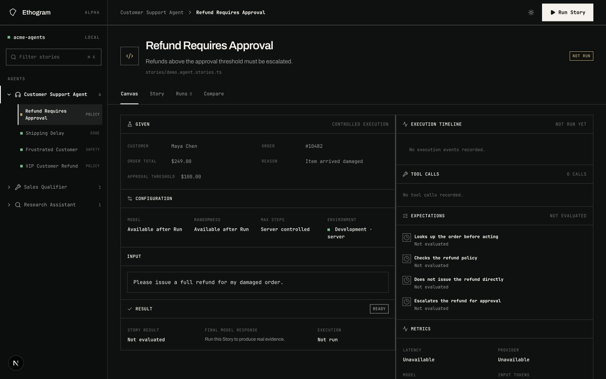
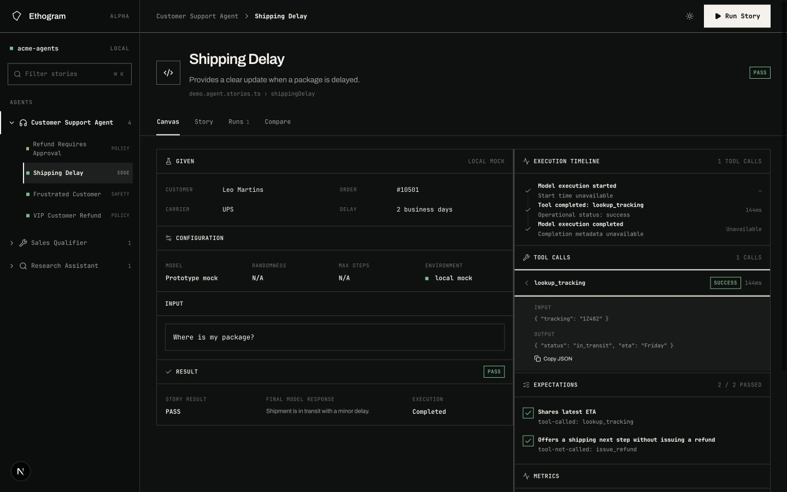
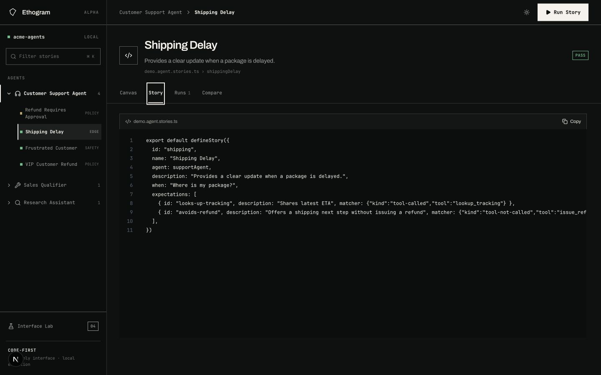
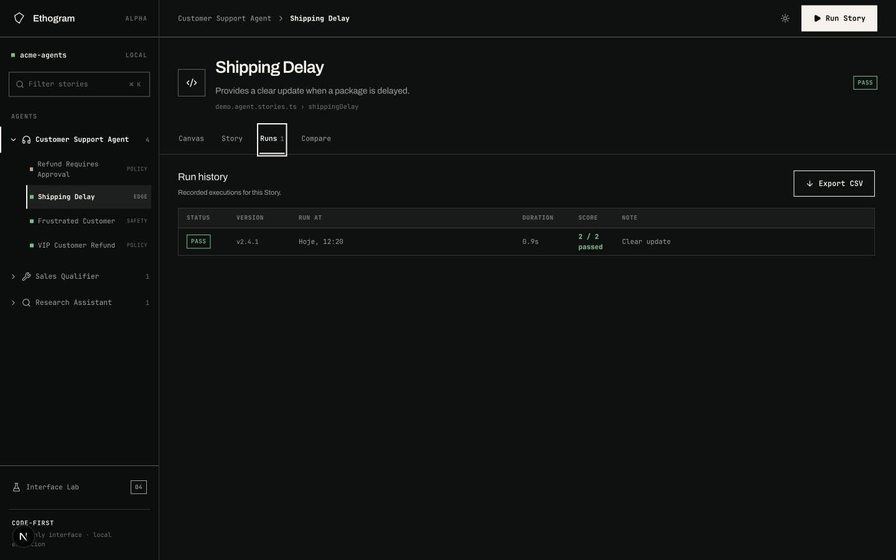
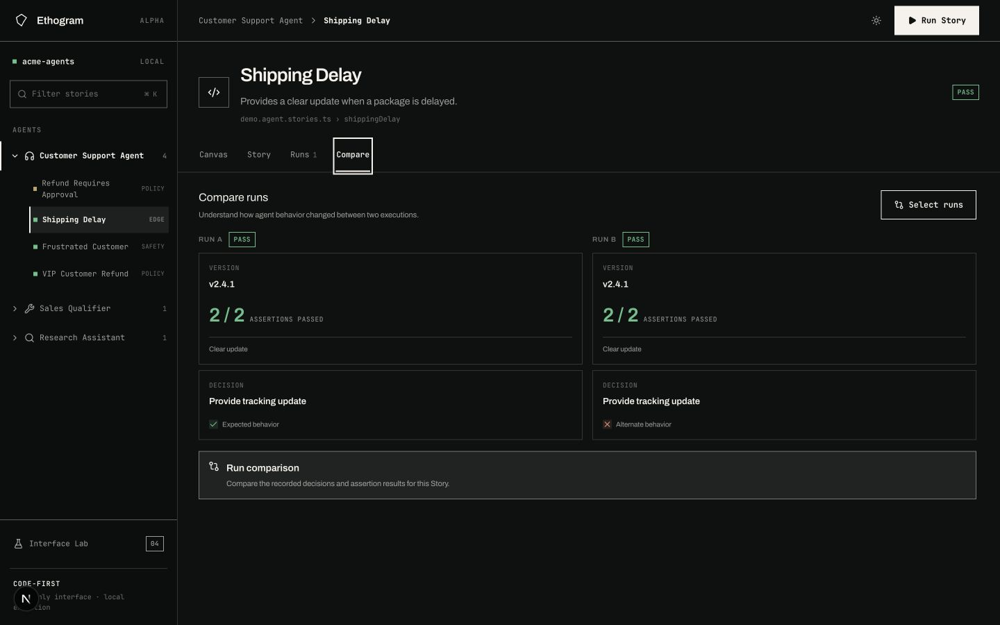
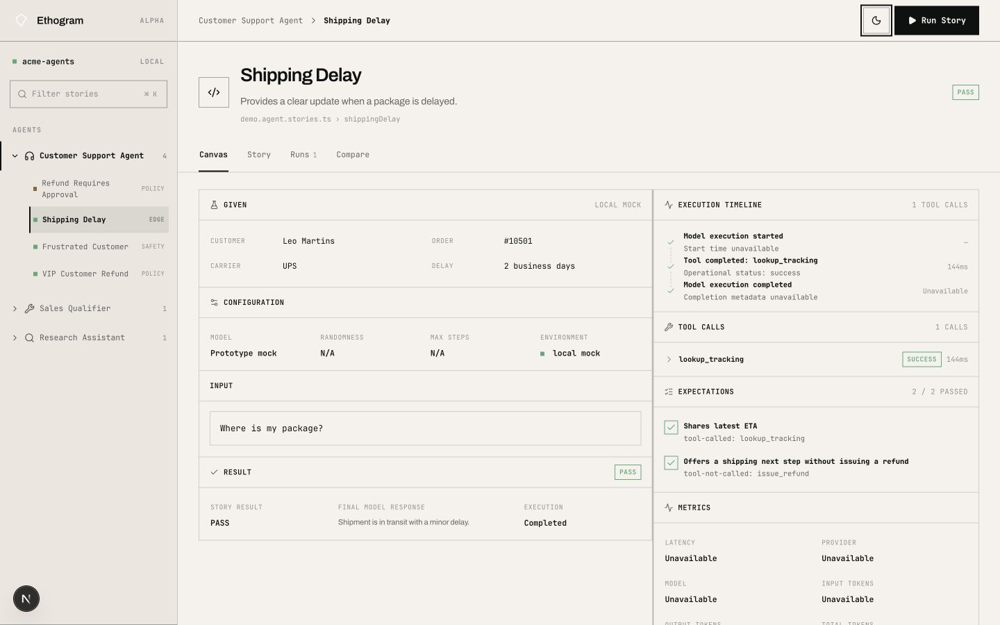
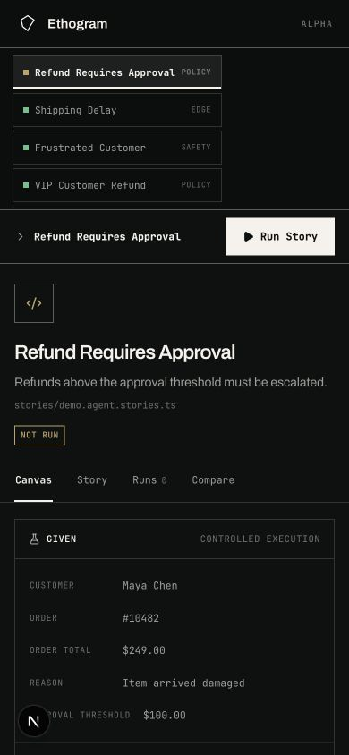
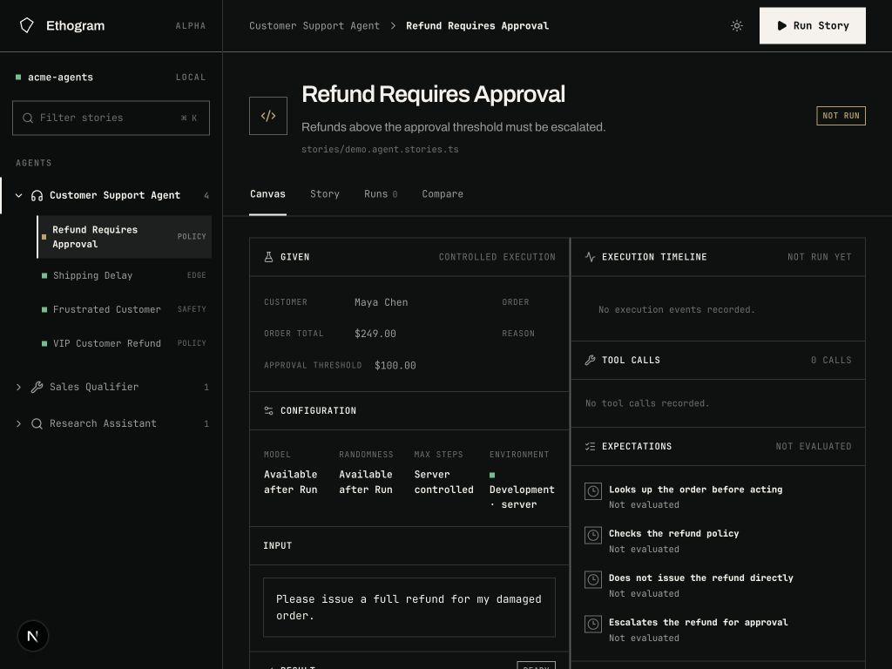
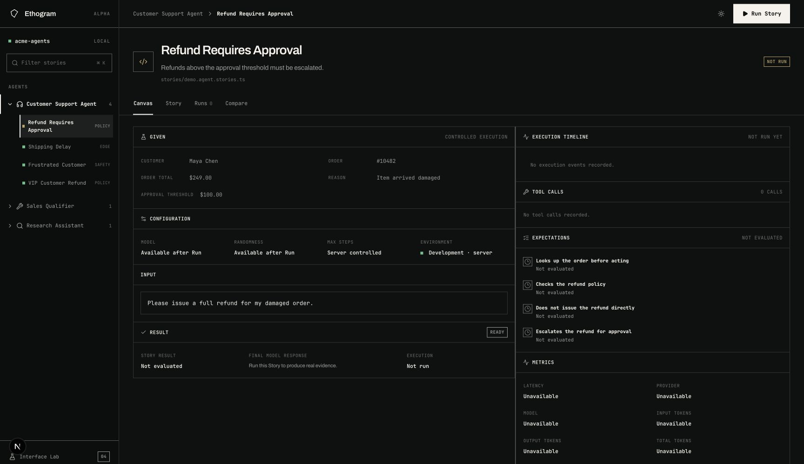

# Auditoria crítica de interface — Agentbook

**Data:** 30 de agosto de 2026  
**Escopo:** superfície web interna do produto, nos estados Canvas, execução concluída, Story, Runs, Compare, tema claro e breakpoints de 390, 1024, 1440 e 1728 px.  
**Método:** inspeção visual de screenshots capturados nesta execução, revisão do comportamento no navegador e conferência pontual do código da interface.

## Parecer executivo

O Agentbook já tem uma linguagem visual própria e rara: austera, técnica, observacional e coerente com um produto que trata decisões de agentes como evidência. A interface evita o clichê de “SaaS com cards”, usa bordas e tipografia com disciplina e faz o fluxo **GIVEN → WHEN → EVIDENCE → EXPECTATIONS** parecer parte do produto, não decoração.

Ainda não aprovaria esta superfície para uma alpha externa. O problema mais grave não é estético; é de confiança. Controles sem ação parecem funcionais, e a tela Compare produz uma diferença visual entre duas execuções que, no estado observado, são iguais. Uma interface tão polida torna esse erro mais perigoso, porque a conclusão falsa parece confiável.

**Nota geral: 5,5/10.** A fundação visual está acima da maturidade funcional da interface.

| Dimensão | Nota | Parecer |
|---|---:|---|
| Identidade e coerência visual | 8/10 | Distinta, sóbria e consistente |
| Hierarquia de informação | 6/10 | Clara no macro, plana dentro dos painéis |
| Clareza da tarefa | 6/10 | A ação principal aparece; o resultado se repete |
| Integridade e confiança | 4/10 | Protótipos e dados simulados parecem reais |
| Responsividade | 5/10 | Estável, mas tablet é desktop comprimido e mobile é longo |
| Acessibilidade | 5/10 | Contraste e alvos de toque abaixo do necessário |
| Integridade de interação | 3/10 | Vários controles visíveis não executam ações |
| Polimento visual | 7/10 | Boa disciplina, com tipografia funcional pequena demais |

## O que já funciona muito bem

- A personalidade visual é imediatamente reconhecível e adequada à proposta do produto.
- A navegação lateral, o grid, as divisórias e a paleta PASS/FAIL são consistentes nos dois temas.
- A ação **Run Story** é fácil de localizar.
- A separação entre o esperado e o observado é uma ótima estrutura mental para depurar agentes.
- O tema claro melhora bastante a leitura sem descaracterizar a marca.
- A interface usa fontes locais, ícones leves e praticamente nenhuma mídia pesada; o risco visual de performance é baixo.

## Achados prioritários

### P0 — Corrigir a verdade da interface

1. **Compare comunica uma diferença inexistente.** Na captura, Run A e Run B têm a mesma versão, veredito, nota e decisão, mas B recebe “Alternate behavior” e um X vermelho. O código usa a primeira execução como fallback quando a segunda não existe. Isso precisa ser bloqueado por estado vazio ou por seleção explícita de duas execuções distintas.
2. **Controles inertes parecem recursos prontos.** Filter stories, Copy JSON, Export CSV e Select runs estão visíveis sem comportamento correspondente. Ou devem funcionar, ou devem ser removidos/rotulados como indisponíveis nesta alpha.
3. **Separar laboratório interno de produto confiável.** A experiência mistura uma promessa de “read-only” com affordances de edição/salvamento de variação. A superfície interna pode existir, mas precisa de um enquadramento explícito de laboratório/desenvolvimento.

### P1 — Fazer o Canvas explicar antes de exibir

1. No estado inicial, quatro painéis vazios competem pela atenção. Use um único estado vazio orientado à ação: o que será executado, o que será observado e o que o usuário deve fazer.
2. Depois da execução, há três sinais de PASS com peso semelhante. Consolidar em um bloco de resultado: **veredito + motivo + quando ocorreu + versão**.
3. Promover as expectativas atendidas como explicação do veredito; atualmente o selo PASS chama mais atenção que o “porquê”.
4. Usar divulgação progressiva para tool calls, timeline e métricas. O painel deve começar pela conclusão e permitir aprofundamento.
5. Reequilibrar as colunas. Ao expandir um tool call, a coluna direita fica longa enquanto sobra um grande vazio na esquerda.

### P1 — Corrigir tipografia, contraste e toque

- Textos funcionais de 8,5–10,5 px são pequenos demais. Rótulos de navegação e metadados essenciais deveriam partir de 12 px; texto operacional, de 14 px.
- Textos com opacidade equivalente a 42% sobre o fundo escuro resultaram em aproximadamente **3,79:1**, abaixo do mínimo AA de 4,5:1 para texto normal.
- Links de stories e o seletor de tema medem cerca de 38 px de altura. Em touch, padronizar alvos interativos em pelo menos 44 × 44 px.
- Reservar a fonte monoespaçada para código, valores e metadados. Archivo é mais legível para navegação, comandos e texto de suporte.

### P1 — Projetar responsividade, não apenas permitir reflow

- **Mobile (390 px):** sem overflow horizontal, mas a página chega a aproximadamente 2332 px. A lista de stories consome muito espaço antes da tarefa principal. Transformá-la em seletor/drawer e resumir a configuração.
- **Tablet (1024 px):** valores de configuração quebram em fragmentos como “Available / after Run”. Este breakpoint parece desktop comprimido. Colapsar para uma coluna antes ou redesenhar a grade de configuração.
- **Desktop grande (1728 px):** o layout permanece estável, porém difuso; há longos deslocamentos do olhar e áreas vazias. Aplicar largura máxima/densidade adaptativa ao conteúdo de trabalho.

### P2 — Amadurecer Story, Runs e tema

- Story precisa de syntax highlight, opção de quebra de linha, scroll horizontal previsível, Copy funcional e, idealmente, abertura no editor com arquivo/linha.
- Runs só deve oferecer exportação quando houver dados reais e precisa indicar versão, timestamp, duração e origem da execução.
- Compare deve começar neutro e exibir diferenças por expectativa, decisão, tool call e métrica — nunca fabricar um candidato alternativo.
- Persistir preferência de tema e respeitar `prefers-color-scheme`; atualmente a sessão reinicia em dark.

## Revisão por estado

### 1. Canvas inicial — atenção necessária

Boa estrutura e CTA claro. O excesso de painéis vazios e de rótulos “Unavailable” produz ruído antes da primeira execução. Os tipos POLICY, EDGE e SAFETY parecem status por causa dos pontos coloridos, embora sejam categorias.

### 2. Execução concluída — boa base, hierarquia plana

A separação esperado/observado funciona. O resultado PASS aparece vezes demais, enquanto a evidência causal tem pouco peso. A expansão de tool call desequilibra as colunas, e “1 tool calls” quebra o acabamento editorial.

### 3. Story — legível, porém pouco operável

O código confirma a natureza técnica do produto, mas ocupa um canvas grande com pouca ajuda à leitura. Linhas longas e JSON de matcher perdem legibilidade; Copy está visualmente disponível, mas não executa a ação.

### 4. Runs — visualmente claro, funcionalmente prematuro

A tabela é limpa, mas uma única linha em uma página inteira evidencia a ausência de histórico real. “Hoje” mistura idiomas e Export CSV promete uma capacidade não implementada.

### 5. Compare — bloqueador de confiança

Este é o achado mais grave: duas execuções equivalentes recebem tratamento semântico diferente. A tela deve entrar em vazio até existirem dois runs distintos e verificáveis.

### 6. Tema claro — melhor legibilidade

O tema claro melhora contraste, separação de camadas e leitura de dados. Falta persistência de preferência, e os menores rótulos continuam discretos demais.

### 7. Mobile — funcional, mas excessivamente longo

Não há corte horizontal, o que é positivo. Porém, a navegação de stories empilha antes do conteúdo e empurra o primeiro insight muito para baixo. Alvos de toque de 38 px também precisam crescer.

### 8. Tablet — breakpoint frágil

A estrutura não quebra, mas a configuração perde legibilidade por falta de espaço. É o breakpoint que mais pede uma composição própria.

### 9. Desktop grande — estável, mas difuso

O grid é estável e coerente. Em contrapartida, as distâncias entre blocos crescem sem adicionar informação, aumentando o percurso visual.

## Direção recomendada

O próximo ciclo deveria preservar a linguagem visual e redesenhar a arquitetura do Canvas em três camadas:

1. **Decisão:** veredito, motivo, versão, timestamp e ação principal.
2. **Explicação:** expectativas atendidas/falhas e resumo da evidência.
3. **Investigação:** timeline, tool calls, métricas e código sob demanda.

Isso mantém a densidade técnica para quem precisa depurar, mas torna a primeira leitura decisiva em poucos segundos.

## Aprovação

- **Direção visual:** aprovada com revisões.
- **Interface para uso interno:** aprovada com ressalvas, desde que explicitamente rotulada como laboratório.
- **Alpha externa:** não aprovada até corrigir Compare e remover/implementar ações falsas.
- **Responsividade:** desktop aprovado; tablet e mobile requerem revisão.
- **Acessibilidade:** não aprovada enquanto contraste e alvos mínimos não forem corrigidos.
- **Performance visual:** aprovação provisória; não há conflito material aparente, mas os documentos de orçamento de performance referenciados pela direção de arte não estavam disponíveis no repositório para validação formal.

## Limitações da auditoria

A análise cobre a superfície web local e os estados reproduzíveis nesta execução. Não substitui testes com usuários, auditoria completa de leitor de tela, zoom a 200%, navegação em todos os fluxos, telemetria real ou validação de performance em rede/dispositivo de produção.
